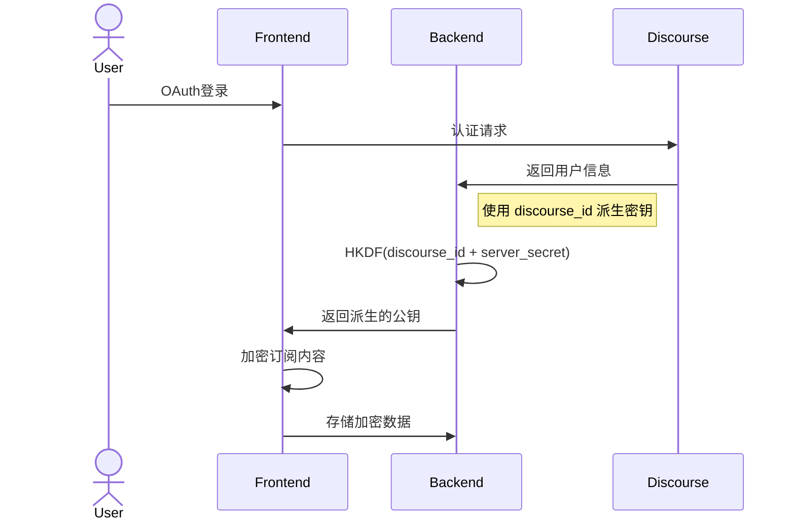
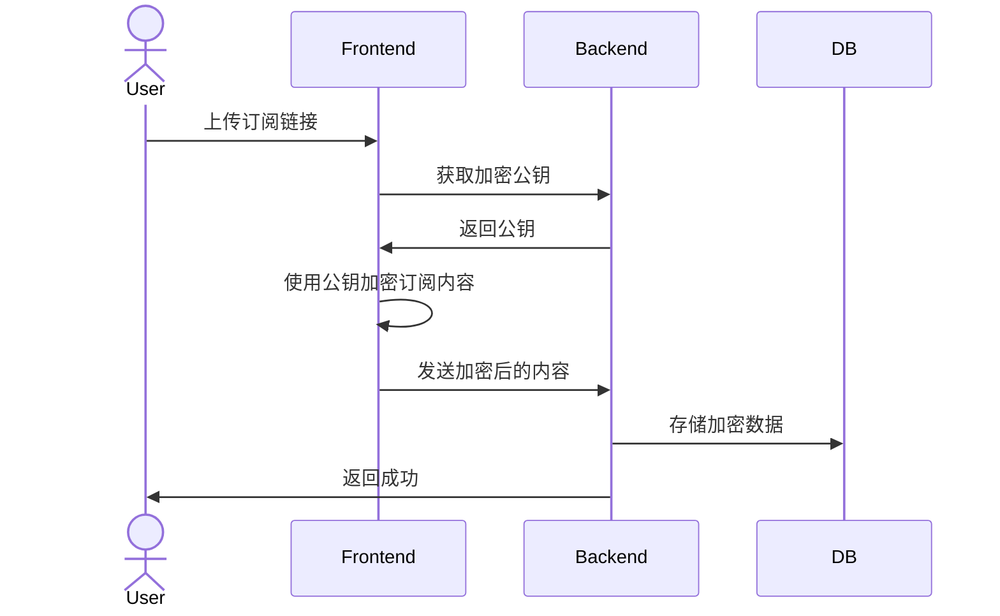
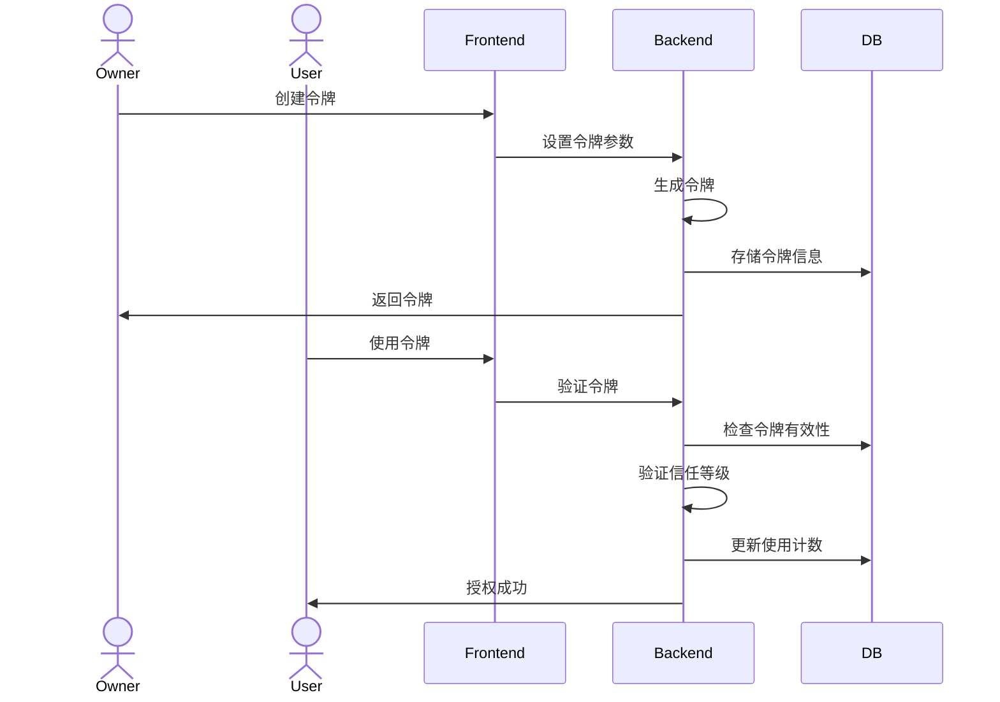
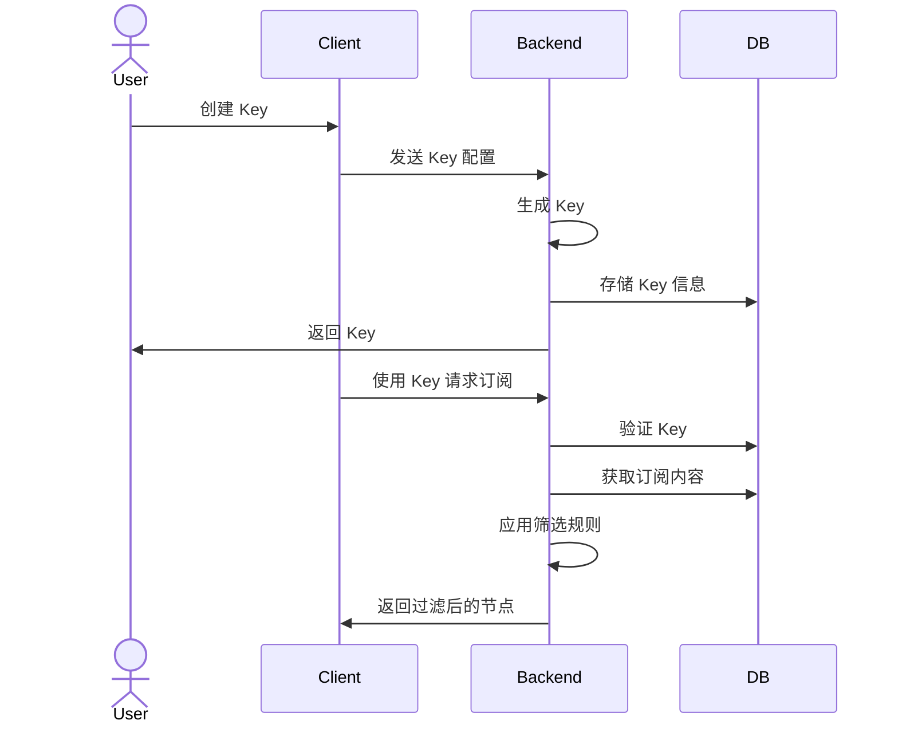
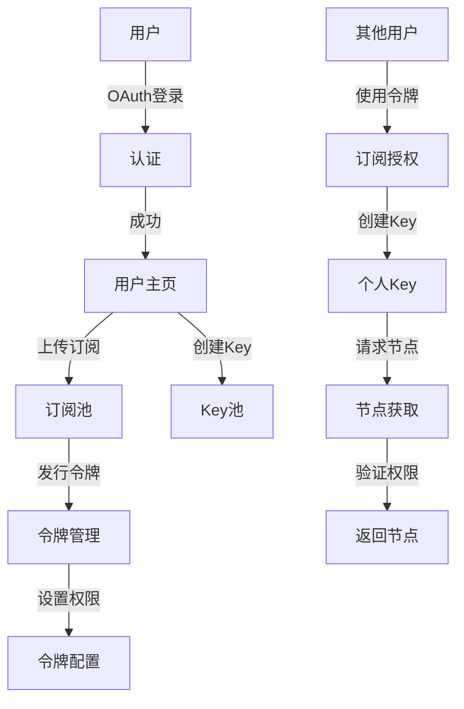

# NodePin

订阅监看管理，汇总配置生成

## 技术栈
- Next.js 14
- TypeScript
- Vercel 部署
- supabase 数据库
- zustand 状态管理

## 功能特性
- 多订阅源管理
- 流量统计追踪
- 节点过滤和分组
- Clash 配置生成


## 开发计划
1. 免责声明页面
2. 主页文本魔法化（react-i18next）
3. 数据库相关代码迁移：mongodb ——> supabase
4. 表结构确定：用户profile表、LinuxDo用户表、订阅表、令牌表、key表、
5. 账号认证系统：Linux.do（discourse社区）OAuth2登录
6. 订阅上传、加密、存储
7. 令牌发行、管理、使用
8. 节点获取、过滤、规则、导出
9. 管理面板：用户管理、令牌管理、订阅管理、节点管理


## 订阅导入
通过 域名/clash 获取配置，可直接导入 clash 客户端

## 数据库表结构
### 订阅信息表
```
{
  "id": 1,
  "name": "测试订阅",
  "url": "订阅地址，需要加密",
  "info": {
    "upload": 123,
    "download": 123,
    "total": 123,
    "expire": 4102329600
  },
  "nodeCount": 10,
  "success": "",
  "level": 0,
  "user_email": "noname@example.com",
  "lastUpdate": 1716268800,
  "createdAt": 1716268800,
  "status": "show" // hide | private | public | shared
}
```


## 认证流程

### 1. 用户认证流程



### 2. 订阅上传和加密流程



### 3. 令牌创建和使用流程



### 4. Key创建和订阅获取流程



### 5. 完整业务流程




## 数据库表结构

